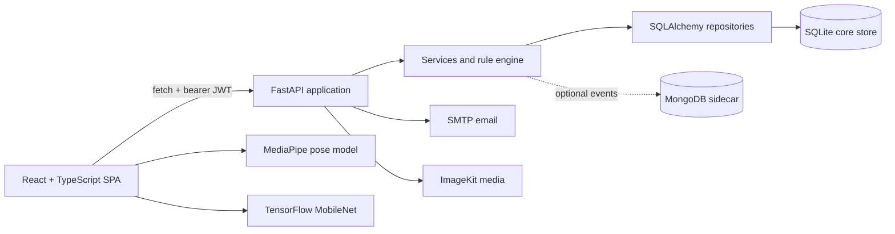

# BodyTune Python-to-Express migration report

Status: Phase 2 foundation implemented in parallel; feature migration not started

Audit date: 2026-07-18

Migration branch: `feat/express-backend-migration`
Related documents: [legacy API inventory](./API_INVENTORY.md) and [migration checklist](./MIGRATION_CHECKLIST.md)

## Executive conclusion

BodyTune is a substantial fitness and nutrition product, not an empty starter. The repository contains a polished React interface, browser-based posture/rep analysis, email/OTP authentication, profiles, nutrition logging, activity streaks, workout history, recommendations, deterministic plan generation, an admin media/catalog area, and subscription-gated videos.

It is not production-ready and should not be deployed in its current form. The principal blockers are object-level authorization failures, browser-exposed admin credentials, a client-side-only premium paywall, public mock subscription activation, plaintext OTP storage, insecure default secrets, JWTs in `localStorage`, no rate limiting/security middleware, an inconsistent legacy database, and committed SQLite data containing accounts and OTP records.

The recommended migration is a controlled parallel replacement:

1. Preserve the Python backend unchanged as the reference implementation.
2. Build the Express/TypeScript backend beside it in `backend-node/` one vertical feature at a time.
3. Keep the currently consumed `/api/v1` paths and snake_case wire fields where safe.
4. Move identity and ownership to secure Mongo-backed sessions; add Google OAuth and retain local email/OTP auth only as a deliberately supported secondary method.
5. Point individual frontend features at Express only after contract, integration, authorization, and UI checks pass.
6. Archive the Python backend and rename `backend-node/` to `backend/` only after parity, migration reconciliation, security review, and rollback rehearsal.

Phase 1 ended without backend code, as required. A later implementation authorization started the parallel foundation described below; the Python backend remains unchanged.

## Phase 2 foundation implementation update

On 2026-07-18, the parallel Node foundation was added under backend-node using the required modular feature-layered flow:

route -> controller -> service -> repository -> model

The health module is the first concrete slice. Its controller contains only HTTP translation, its service owns liveness/readiness behavior, and its repository owns the MongoDB connection/ping check. ESLint restrictions prevent controllers from importing repositories/models, services from importing Express/models, repositories from importing HTTP/services, and shared code from importing feature modules.

Implemented foundation capabilities:

- Node.js 24 LTS baseline, locked npm dependencies, strict TypeScript, CommonJS production output, ESLint, Prettier, Jest, ts-jest and Supertest.
- Pure Express app factory with configuration/logger/readiness injection; server-only environment loading, MongoDB connection, listening and signal registration.
- Zod environment validation with exact credentialed CORS origins, bounded request sizes, safe proxy configuration, isolated test-database naming, Mongo connection retry limits and production fail-closed checks.
- Pino/Pino HTTP request logging with request IDs, response time and secret/PII redaction; Pino Pretty is development-only.
- Helmet, HPP, exact CORS, bounded parsers, cookie parsing, Mongo operator/prototype-key rejection and a global API rate limiter. Authentication-specific limiters remain part of the authentication phase.
- Typed errors, Zod/Mongoose/duplicate/ObjectId/parser mappings, safe production errors, development stacks, not-found handling and one standard response envelope.
- GET /health liveness and GET /ready cached MongoDB ping readiness, with no driver/topology details returned.
- Bounded Mongo startup retries, readiness shutdown state, graceful HTTP drain, Mongo disconnect and deterministic process termination.
- Multi-stage non-root Dockerfile, local Mongo Compose configuration, environment example, backend setup/architecture documentation and an OpenAPI 3.1 foundation contract.
- Database/dump/journal and generated-runtime ignore patterns. Existing tracked legacy databases were not deleted or untracked.

Verification evidence:

| Check | Result |
| --- | --- |
| npm ci --ignore-scripts --no-audit | Passed from the committed lockfile. |
| Format / ESLint / strict TypeScript / production build | Passed. |
| Jest and Supertest | 24 tests across five suites passed with open-handle detection. |
| Coverage gate | Passed: 79.84% statements, 67.29% branches, 77.21% functions and 79% lines. |
| Real Mongo smoke | Passed against an isolated temporary MongoDB: health stayed 200, readiness changed from 200 to 503 after Mongo stopped, and SIGINT completed cleanly. |
| Docker Compose render | Passed. |
| Docker image build | Not run because the local Docker daemon was unavailable; this remains an open foundation check. |

No frontend route was pointed to Express, no authentication/product model was introduced, and no Python or SQLite implementation was removed in this foundation slice.

## Audit scope and evidence

The audit covered all 226 tracked files and approximately 35,000 lines, excluding generated dependencies/build output. It included:

- Git branch, status, remotes, and history.
- Root documentation and ignore rules.
- Every Python route, model, schema, repository, service, rule module, test module, and database configuration file.
- Every React route, page, feature service, auth guard/provider, API client, feature type, and the workout/nutrition browser inference flows.
- The tracked SQLite database and rollback journals using aggregate/schema queries only. No account, password-hash, OTP, or other personal values are reproduced in this report.
- Dependency manifests, environment examples, scripts, deployment assets, tests, logging, and security controls.

Baseline commands and results:

| Check | Result |
| --- | --- |
| Git worktree before audit | Clean on `main`; one commit; `origin/main` at the same commit. |
| Safety branch | Created `feat/express-backend-migration`; no work will be pushed directly to `main`. |
| Python tests | Not executed: the current interpreter has no `pytest` installation. |
| Frontend build | Not executed: dependencies are absent, so `tsc` is not available. |
| `npm ls --depth=0` | All declared packages are currently unmet because `node_modules` is absent. |
| Existing automated suite | 129 Python test functions; no frontend tests, lint configuration, coverage configuration, or CI workflow. |
| Docker/deployment assets | None. |

These environment failures do not prove the source is broken, but they mean the current checkout has no verified green baseline. Every behavior below is therefore described as implemented, partial, unsafe, or missing rather than “passing.”

## Product understanding

BodyTune serves two roles:

- A user tracks workouts and nutrition, receives form feedback and rule-based recommendations, views a dashboard/streak heatmap, creates personalized fitness/meal plans, and watches free or premium exercise videos.
- An admin views summary/user data, uploads ImageKit media, manages exercise videos, and manages subscription plans.

The most distinctive feature is client-side live workout coaching. Camera frames are processed in the browser with MediaPipe pose landmarks and exercise-specific joint-angle/form rules. The frontend supports squat, push-up, crunch, and bicep curl. Session summaries are meant to be saved to the backend and then used for history, dashboard statistics, and recommendations.

Nutrition combines a seeded food catalog and manual/custom food logging with optional browser-side MobileNet image classification. The backend stores uploaded meal images and has a filename-based suggestion fallback. “AI Plan” is currently a 649-line deterministic rules engine that calculates BMR/TDEE/macros, chooses foods/workouts, adapts some injury keywords, and returns safety notes. It does not call an AI model or LLM.

## Existing architecture

### Backend

- `backend/app/main.py` creates one FastAPI app, mounts public local uploads, registers 14 route modules, creates/patches SQLite tables at startup, seeds auth users and foods, and optionally connects MongoDB.
- Most feature code follows route/controller-like functions -> services -> repositories -> SQLAlchemy models. The separation is useful and should inform the Express modules.
- SQLite/SQLAlchemy is the actual system of record for accounts, profiles, workouts, nutrition, activity aggregates, generated plans, videos, recommendations, and subscriptions.
- MongoDB is optional and additive. It stores fire-and-forget `activity_events` and exposes a second, disconnected video CRUD surface. It is not a source of truth and there is no reconciliation with SQLite.
- SMTP sends OTP email synchronously. ImageKit uploads admin video/thumbnail assets synchronously.
- FastAPI supplies generated OpenAPI docs, but the repository has no maintained API contract or production operations documentation.

### Frontend

- Vite/React 19/TypeScript uses lazy-loaded route pages, feature service files, and a centralized `fetch` wrapper.
- Auth state and bearer JWTs are persisted in `localStorage`. The client sends `credentials: "omit"` and only restores a user when a stored token already exists.
- Most substantial pages implement loading, error, empty, and success states. This UI should be preserved rather than rewritten.
- State is local React state/context; there is no server-state/query library and no generated contract types.
- Browser inference depends on external MediaPipe WASM/model URLs. Food classification uses dynamically imported TensorFlow/MobileNet.

### Persistence reality

The configured runtime filename is `backend/fitness_coach.db`, but that file is absent. A fresh start would create a new database. The repository instead tracks one legacy database named `fitness_coach.db.backup-before-rewrite` and ten rollback-journal artifacts.

Startup seeds users and foods only. Although seed functions for subscription plans and exercise videos exist, `main.py` does not call them. A fresh database therefore has no plans or video catalog. The backup has no `ai_plans` table and predates several code-level columns/constraints.

## Frontend route and page inventory

| Access | Route | Page/behavior | Audit state |
| --- | --- | --- | --- |
| Public | `/` | Marketing landing page and theme toggle | Preserve. |
| Public | `/login` | User email/password login | Replace token handling; add Google sign-in. |
| Public | `/admin/login` | Same login page in admin mode | Preserve role-aware redirect; no separate admin credentials in the browser. |
| Public | `/register` | User or admin registration | Preserve user registration if local auth remains; remove public admin registration. |
| Public | `/verify-otp` | OTP verification/resend with a user-selectable purpose | Split account verification from reset semantics; current purpose selector can turn a reset OTP into a login. |
| Public | `/forgot-password` | Request reset OTP | Preserve with throttled generic response. |
| Public | `/reset-password` | Submit OTP and new password | Preserve; invalidate sessions. |
| User | `/dashboard` | Profile/nutrition/workout/activity/subscription summary | Preserve after source modules migrate. |
| User | `/profile` | Profile and nutrition-goal editor | Preserve. |
| User | `/workouts` | Workout cards and aggregate history | Preserve. A selected card currently opens the generic live page without carrying the exercise; live page defaults to squat. |
| User | `/workouts/live` | Camera, pose, angle, form, rep, and session UI | Preserve browser processing. Persist all four implemented exercise types. |
| User | `/diet` | Food search/logging, meal upload, browser image suggestions, daily totals | Preserve with owner-scoped APIs and private media. |
| User | `/ai-plan` | Plan form/history/result/PDF export | Preserve rule engine honestly; “Save” action is currently disabled. |
| User | `/library` | Search/filter video catalog and paywall display | Preserve after enforcing entitlement server-side. |
| User | `/library/videos/:videoId` | Video playback and watch activity | Preserve; receive signed media only after entitlement. |
| User | `/subscription` | Plan display and immediate mock activation | Replace mock activation with a real checkout/webhook flow or disable paid plans in production. |
| User | `/results` | Workout history, charting, summary, empty/error states | Preserve with pagination. |
| User | `/settings` | Local dark/light theme and camera privacy note | Preserve; no account/security settings currently exist. |
| Admin | `/admin/*` | One large dashboard/users/videos/plans page for several navigation URLs | Preserve UI initially; split only if maintainability work is justified. |
| Admin | `/admin/settings` | Reuses the general local theme page | Add an actual safe operational/settings view only if required. |

There is no catch-all 404 route. Unknown paths can render no matched page.

## Feature inventory and disposition

| Product area | Present behavior | Current state | Migration decision |
| --- | --- | --- | --- |
| Local auth | Registration, verification, login, forgot/reset OTP, bearer JWT | Implemented but unsafe defaults, purpose confusion, plaintext OTPs, no global limits, no logout/revocation | Retain as optional secondary auth using secure sessions and hashed, rate-limited challenges. |
| Google OAuth | None | Missing | Required early vertical slice with Passport Google OAuth 2.0. |
| RBAC | `user`/`admin`, frontend guards, mixed backend guards | Partial; static key bypass and many routes have no auth | Central session auth and role/ownership policies. |
| Profile | Physical attributes, fitness goal, experience, macro goals | Implemented; duplicated between auth user/profile and public CRUD routes | Embed one profile in User; expose owner-scoped `/me`. |
| Dashboard | Aggregates current user data and simple insights | Implemented; loads full histories and depends on inconsistent IDs | Preserve, migrate last after source modules, use database aggregates. |
| Activity | Daily counters, heatmap, current/longest streak, optional events | Implemented; race-prone read/modify/write, server-local dates, client can self-increment | Atomic daily aggregates keyed by user timezone; trusted domain events. |
| Live workouts | Four browser exercises with pose/form rules | Strong frontend implementation | Preserve browser-only frame processing and add contract/UI tests. |
| Workout persistence | Results, summaries, recommendations | Partial; backend database constraint supports only two exercises and CRUD is largely public | Owner-scoped results for all four exercises; idempotent recommendation generation. |
| Nutrition | Seeded foods, search, custom foods, meal logs and totals | Implemented but public/arbitrary-user APIs and unbounded search | Owner-scoped logs, indexed search, nutrient snapshots, pagination. |
| Meal photos | Public local upload path, filename fallback, browser MobileNet suggestions | Partial; private content is publicly mounted and legacy files are absent | Private external object storage, signed access, validation, retention/deletion policy. |
| Generated plans | Deterministic nutrition/workout rules and PDF export | Implemented; marketed as AI and accepts medical free text | Preserve as versioned rules engine, minimize sensitive inputs, strengthen medical disclaimer/review. |
| Video catalog | Admin CRUD/upload, ImageKit metadata, free/premium listing | Implemented but locked responses include the media URL; delete leaves assets orphaned | Enforce entitlement on server and use signed URLs; coordinate asset lifecycle. |
| Subscription | Admin plans, active periods, premium flag | Demo only; any caller can activate any user's plan without payment | Payment-provider decision required. Verify webhooks and idempotency; no production mock route. |
| Admin panel | Summary, users, videos, plans, upload | Implemented but unpaginated and partly protected by browser-exposed key | Session RBAC only, safe projections, pagination, audit events. |
| Mongo sidecar | Optional activity events and duplicate videos | Incomplete/duplicative | Replace with MongoDB as the single core persistence layer; retire `/mongo/*`. |
| Logging/errors | Basic Python logs and one catch-all response | Incomplete | Pino/Pino HTTP, request IDs, redaction, typed errors, standardized envelopes. |
| Operations | One `/health` route | Incomplete; always says overall `ok`, no Docker/CI/readiness/shutdown/retry docs | Add liveness/readiness, graceful shutdown, Docker, CI, deployment runbook. |

The detailed 66-route inventory and migration disposition is maintained in [API_INVENTORY.md](./API_INVENTORY.md).

## Current persistence and data inventory

### SQL relationships and migration disposition

| Legacy model | Current relationship/problem | MongoDB disposition |
| --- | --- | --- |
| AuthUser | Identity, password hash, role and verification; duplicates some profile fields | User is the identity root. Normalize email, store OAuth providers, hide any password hash by default, embed the one-to-one profile, and retain a unique legacyId only for reconciliation. |
| UserProfile | Physical/profile and nutrition goals; ID equals AuthUser ID only by convention, not by foreign key | Embed in User unless profile write volume later proves separation necessary. Never fabricate age, height, or weight when onboarding is incomplete. |
| OTPVerification | Plaintext code, email, purpose, expiry, use flag | Do not import. If local auth remains, create OtpChallenge with a keyed hash, purpose, bounded attempts, consumed timestamp, expiry TTL, and no reusable login semantics for reset challenges. |
| ActivityLog | One daily aggregate per user; read/modify/write increments and server-local date | ActivityDaily with unique userId + dateKey, timezone snapshot, and atomic increments. Add allowlisted ActivityEvent records only where audit or analytics needs them. |
| WorkoutResult | Client session metrics and feedback | WorkoutResult referencing User, with bounded metrics, supported exercise enum, client session idempotency key, and userId + createdAt indexes. |
| Recommendation | Rule output tied to a user and result | Recommendation referencing the owned result, rule version, and a uniqueness/idempotency rule so retries do not duplicate output. |
| FoodItem | System and globally visible custom foods; aliases are comma-delimited | FoodItem with source, optional ownerId, normalizedName, alias array, nutrient snapshot fields, and partial unique indexes for system versus per-owner custom items. |
| MealPhoto | Public local path and mostly unused analysis state | MealAsset referencing its owner and a private storage provider/key. Store MIME, bytes, dimensions, checksum, status and retention timestamps; never expose the provider key directly. |
| DietLog | Food reference plus nutrient snapshot and optional photo | DietLog referencing User and optional FoodItem/MealAsset while retaining the consumed name/nutrient snapshot. Index userId + loggedAt and userId + mealType + loggedAt. |
| AIPlan | Full input JSON, including allergy/medical free text, plus generated JSON | GeneratedPlan with generator kind/version, minimized structured inputs, explicit risk flags and output. Raw medical notes should be omitted by default or separately encrypted with a defined retention purpose. |
| ExerciseVideo | Catalog, access tier, local/ImageKit metadata | Video as the single catalog. Store provider identifiers, active/tier metadata and safe public projections. Authorized playback returns a short-lived signed URL, never a durable premium URL. |
| SubscriptionPlan | Float price, duration and feature strings | SubscriptionPlan with integer amountMinor, currency, billing interval/duration, explicit entitlements, versioning and active state. |
| UserSubscription | Plan reference, status and dates; userId has no foreign key | Subscription referencing User/Plan, provider identifiers, status and period. Add provider-event uniqueness and rules preventing conflicting current entitlements. |

Recommended supporting collections are Mongo-backed sessions with a TTL index, PaymentWebhookEvent for verified idempotent provider events, AuditEvent for privileged changes, and MigrationRun/ID maps for resumable imports.

The legacy SQLite connection does not enable foreign-key enforcement, so declared cascades cannot be trusted. Mongo application code must compensate with explicit ownership checks and transactional operations where a feature spans multiple documents.

### Candidate legacy dataset

The runtime database is absent. Read-only aggregate inspection of the tracked backup found:

| Record type | Count/state |
| --- | --- |
| Auth users | 11; all stored hashes use the legacy PBKDF2 format |
| Profiles | 2; most auth rows therefore have no matching profile |
| Admins | 4; two verified and two unverified, all requiring manual review |
| Daily activity rows | 2 |
| Foods | 184 |
| Diet logs / meal-photo rows | 1 / 5 |
| Workout results / recommendations | 3 / 3 |
| Subscription plans / subscriptions | 3 / 5 |
| Exercise videos | 6 |
| OTP rows | 16 plaintext challenges; none may be imported |
| Generated plans | No legacy table exists |

As of the audit date, both subscriptions labelled active in the backup were already expired. All six video records point to absent local files, and the application does not mount their recorded path. All five meal-photo paths are also absent. Those records cannot be presented as available assets after migration.

This backup is only a candidate source. Product ownership must decide whether it is authoritative and whether there is a lawful need and user consent to retain any of it. A fresh production launch with no legacy personal-data import is the safest default if the rows are demo/development data.

### Sensitive data incident

The backup and ten SQLite journal artifacts are already tracked in Git and contain, or may contain, account identifiers, physical profile data, password hashes and plaintext OTP material. The repository remote contains the commit that introduced the current tree. A normal deletion commit will stop future checkouts from using the files but will not remove them from history.

Immediate response is separate from the Node migration:

1. Classify the repository/remote exposure and owners; do not assume that the remote is public or private without checking.
2. Rotate the JWT secret, admin keys, seed/admin credentials, SMTP/ImageKit/OAuth secrets and any reused user/admin passwords.
3. Invalidate all legacy OTPs and active authentication material; require password reset or verified Google linking for retained users.
4. Manually review every legacy admin before carrying a role forward.
5. Stop tracking databases/journals and add precise ignore rules without destroying the only source snapshot before an approved disposition.
6. If the remote was shared, use the hosting provider's incident guidance and coordinate a history purge. The project instruction forbids force-pushing; therefore history rewriting requires an explicit, separately authorized exception and collaborator coordination. It must not be performed as a routine migration commit.
7. Record the decision, notification obligations, retention basis and final destruction/import evidence.

## Security review

### Critical

1. **Committed sensitive database artifacts.** Account, health-related and authentication material has entered Git history.
2. **Public object-level access and mutation.** Large portions of profiles, results, recommendations, diet, photos and subscriptions accept no authentication or trust caller-supplied user IDs.
3. **Subscription and premium bypass.** Any caller can invoke mock purchase for an arbitrary user; locked video objects still contain the media URL; anonymous requests can supply another user ID.
4. **Administrative bypass.** A static key with a known default is accepted instead of an admin identity, and the frontend compiles that key into its public bundle. Public registration also offers an admin role.
5. **OTP purpose confusion.** A forgot-password OTP can be verified through the general endpoint and exchanged for a login token. OTP values are plaintext and verification attempts are unbounded.

### High

- HS256 JWTs default to a known secret, live for 24 hours in localStorage, and have no issuer/audience/JTI, refresh, revocation, logout or password-reset invalidation.
- Current APIs leak health/profile and generated-plan inputs, including medical/allergy text, beyond a defensible ownership boundary.
- There is no global or auth-specific rate limiting, no production environment validation, no CSRF design, and no security header/HPP middleware.
- Meal images are served from a public static directory. Video entitlement is a response decoration rather than an asset authorization boundary.
- Admin/user list endpoints return unbounded records and use broad projections.
- Image uploads buffer up to 100 MB and primarily trust filename extensions. Upload/database/delete lifecycle failures leave orphan assets.

### Medium and operational

- Error responses vary and the fallback exposes exception class names; logs are unstructured and lack redaction, request IDs and audit context.
- CORS is a local hard-coded allowlist with credentials disabled, which is incompatible with cookie sessions.
- The health endpoint reports top-level success even when a datastore check fails.
- FastAPI development documentation endpoints are public by default.
- Relative/protocol-relative media URL acceptance, missing content signature inspection, and public uploads expand stored-content risk.
- There are no documented retention, export, deletion or account/session management flows for fitness, nutrition, photo and medical-adjacent data.

### Required target controls

- Validate all environment variables at startup and reject default, missing or production-incompatible values.
- Apply Helmet, an exact credentials-enabled CORS allowlist, HPP protection, bounded parsers/uploads, query/operator allowlists, route-specific rate limits, secure proxy settings and centralized Zod validation.
- Use Pino/Pino HTTP with a generated or accepted request ID. Redact authorization, cookies, set-cookie, passwords, OTPs, OAuth credentials, admin fields and personal identifiers.
- Implement typed operational/programmer errors with one safe envelope. Return stack traces only in local development.
- Authorize every operation from the session and resource owner/role. Never trust userId, role, entitlement or price from a request body/query.
- Keep private media private and mediate it with short-lived signed access after an entitlement/ownership check.
- Add privileged-action audit events without logging secrets or full sensitive payloads.
- Disable or authenticate API documentation in production and separate liveness from readiness.

## Functional, reliability and performance findings

### Broken or materially incomplete

- Fresh startup omits subscription/video seeders, so a new installation lacks those features.
- The persisted workout constraint only supports squat and push-up while frontend/schema code also supports crunch and bicep curl. The frontend additionally loses the chosen workout on navigation and defaults every card to squat.
- Result creation and recommendation generation are two requests. A partial success is reported as a total failure and retry can duplicate data.
- The generated-plan feature is deterministic rules code, not an AI service; monthly_budget is accepted but unused. Product copy and medical-adjacent claims need review.
- Meal-photo backend suggestions are filename keywords, not vision analysis; browser suggestions require user confirmation and upload/log failure can orphan an asset.
- Subscription activation is an explicit mock with no checkout, provider signature, webhook, refund or idempotency path.
- The optional Mongo video store is disconnected from user-facing videos and duplicates SQL without synchronization.
- Media rows in the candidate backup reference files that do not exist.
- The diet page labels lifetime aggregate totals as Today and hard-codes nutrition goals instead of using the profile.
- Video-watch activity is recorded when details load, not after meaningful authorized playback, and ignores the video identifier.

### Reliability and consistency

- Registration, profile creation, OTP mutation and email delivery commit independently. Purchases deactivate and create in separate commits. Media upload and catalog writes are similarly non-atomic.
- Activity counters use a race-prone read/modify/write cycle; multiple subscriptions can become active under concurrency.
- SQLite table creation, patching and seeding occur on worker startup without versioned migrations.
- Naive local and UTC datetimes are mixed. Nutrition/activity day boundaries and streaks use server time rather than the user's timezone.
- Fire-and-forget Mongo event writes are not awaited/drained. External SMTP/ImageKit calls have no durable retry/outbox behavior.
- Composite frontend Promise.all calls make library, subscription and admin pages discard usable partial data after one failure.
- Browser inference loads unpinned latest/external model assets and can run every animation frame; CSP, caching, throttling and fallback behavior are undefined.

### Performance and maintainability

- List endpoints have no pagination. Food search, dashboard/workout summaries and admin counts load whole collections and aggregate in application memory.
- There are no query budgets, slow-query telemetry or database index definitions for current Mongo collections.
- Large plan history responses include every complete input/output JSON object.
- The frontend API client has no timeout, cancellation, retry classification, correlation ID or runtime response validation.
- There is no frontend test/lint/format setup, CI, Docker configuration or versioned operational runbook.
- General profile/result/recommendation CRUD, Mongo video endpoints, generic activity recording and several UI components/services have no current frontend consumer. They should be removed after contract confirmation, not blindly ported.

## Target Express/Mongo architecture

~~~text
backend-node/
  src/
    app.ts
    server.ts
    config/
      env.ts
      database.ts
      cors.ts
      logger.ts
      passport.ts
      session.ts
    middlewares/
      authenticate.ts
      authorize.ts
      csrf.ts
      error-handler.ts
      not-found.ts
      rate-limit.ts
      request-id.ts
      validate.ts
    modules/
      auth/
      users/
      activity/
      workouts/
      recommendations/
      nutrition/
      generated-plans/
      videos/
      subscriptions/
      admin/
      health/
    shared/
      errors/
      http/
      security/
      types/
      utils/
    routes/
      index.ts
    scripts/
      migrate-sqlite.ts
      reconcile-migration.ts
      seed.ts
  tests/
    unit/
    integration/
    contract/
    fixtures/
    helpers/
  docs/
    openapi.yaml
  Dockerfile
  package.json
  tsconfig.json
~~~

Each module owns its route definitions, Zod input schemas, thin controllers, business service, repositories, Mongoose schemas/models, policy functions and tests. Controllers translate HTTP only; services own transactions and domain rules; repositories own queries/projections. Shared middleware must not contain feature-specific authorization decisions.

~~~mermaid
flowchart LR
  SPA[React TypeScript SPA] -->|secure session cookie + CSRF| Edge[Same-site HTTPS edge]
  Edge --> Express[Express API]
  Express --> Policy[Auth, RBAC, ownership and validation]
  Policy --> Modules[Feature services]
  Modules --> Mongo[(MongoDB + sessions)]
  Modules --> Media[Private media provider]
  Modules --> Mail[Email provider]
  Modules --> Pay[Payment provider]
  SPA --> Pose[MediaPipe pose model]
  SPA --> FoodML[TensorFlow MobileNet]
~~~

Recommended deployment is same-site behind one HTTPS origin or reverse proxy, for example app.example.com with API under /api. This makes secure cookies and CSRF reasoning simpler while preserving the SPA.

## Authentication and session design

1. Use express-session with connect-mongo. Store only the user ID and session version; load a safe user projection per request.
2. In production use a host-only cookie with the __Host- prefix, Secure, HttpOnly, Path=/ and no Domain. SameSite=Lax is appropriate for the recommended same-site topology; a genuinely cross-site deployment requires SameSite=None, Secure, exact credentialed CORS and stronger explicit CSRF controls.
3. Regenerate the session after every successful password or OAuth login. Destroy it on logout and clear the cookie with identical attributes.
4. Passport Google OAuth must use state, an exact callback, and an allowlisted return target stored in the session. Link an existing legacy account only when Google supplies a verified email. OAuth input can never grant an admin role.
5. Use a sessionVersion or equivalent revocation field so password reset, account disablement, role changes and logout-all invalidate existing sessions.
6. Verify Origin/Referer for unsafe methods and use a CSRF token strategy suited to the final topology. OAuth state is required but is not general request CSRF protection.
7. If local auth remains, use Argon2id/bcrypt with an explicit upgrade strategy, generic enumeration-safe responses, password rules, keyed-hash OTPs, purpose separation, attempt caps and layered rate limits. Do not silently accept exposed legacy hashes as normal production credentials.
8. Remove browser-stored bearer tokens, VITE_ADMIN_KEY, X-ADMIN-KEY, public admin selection and caller-supplied identity.

## API and frontend compatibility strategy

The first Express version should retain /api/v1, snake_case DTO fields, ISO-8601 dates and current high-value endpoint names. This avoids mixing authentication, persistence and cosmetic contract changes in one cutover. Mongo identifiers must nevertheless become a single public string id contract; every frontend DTO/service/form comparison must be updated together before a Mongo response is exposed.

Use one documented response model. The newer implementation brief explicitly selected a camelCase envelope, while feature DTO fields remain snake_case during compatibility:

- Success: success, message, data and meta; meta contains requestId and optional pagination.
- Paginated list: data array plus meta.page, meta.pageSize, meta.total, meta.totalPages and meta.hasMore.
- Failure: success false plus top-level message, code, errors and requestId.
- Empty successful delete: either consistent 204 or the standard data envelope, never feature-specific ambiguity.

During the compatibility window, the frontend API client can unwrap envelopes centrally and map the new error format while individual pages retain their data shapes. Contract tests must pin every consumed path. Deprecated public/arbitrary-user paths should return a clear removal response after the frontend switches; they should not be kept merely for parity.

The coordinated frontend authentication cutover must:

- send credentials: include and bootstrap /auth/me without a local token;
- remove Authorization headers and auth/user localStorage state;
- call server logout and handle Google redirect/callback failures;
- obtain/send the chosen CSRF token when required;
- treat session user/role as authoritative;
- use string IDs everywhere and remove Number conversions;
- distinguish 401 from 403 and preserve a request ID in user-support errors.

## MongoDB schema and index baseline

At minimum:

| Collection | Required indexes |
| --- | --- |
| users | unique normalized email; unique sparse providers.google.subject; role + status where admin queries require it |
| sessions | TTL on expires as created by connect-mongo; user/session-version lookup as required |
| otp_challenges | TTL on expiresAt; email hash + purpose + createdAt; never index plaintext email/code logs |
| workout_results | userId + createdAt descending; userId + exerciseType + createdAt; unique userId + clientSessionId |
| recommendations | userId + createdAt; unique resultId + ruleVersion |
| foods | normalized searchable fields; partial unique system normalizedName; partial unique ownerId + normalizedName for custom foods |
| meal_assets | userId + createdAt; storage status + createdAt for cleanup |
| diet_logs | userId + loggedAt descending; userId + mealType + loggedAt |
| activity_daily | unique userId + dateKey; userId + dateKey descending |
| generated_plans | userId + createdAt descending; optional expiry/retention TTL only after product approval |
| videos | active + category + difficulty; accessTier + active; provider asset ID unique sparse |
| subscription_plans | unique stable code/version as designed; active + sort order |
| subscriptions | userId + status + currentPeriodEnd; provider subscription ID unique sparse |
| payment_webhook_events | provider + event ID unique; processing status + receivedAt |
| audit_events | actorId + createdAt; target type/id + createdAt; retention index/policy |

Every list query needs explicit sorting, a maximum page size, projection, and explain/slow-query review. Do not accept raw Mongo filters, sort objects or operators from request input.

## Data migration, cutover and rollback

The import must be a versioned, idempotent CLI, never application startup behavior.

1. **Authorize the source.** Confirm whether the backup is real, demo or stale; locate any actual production SQLite/Mongo/media sources; document consent and retention.
2. **Quarantine and snapshot.** Take a read-only, checksummed source copy under an exclusive lock and record schema/table counts without placing it in Git.
3. **Dry-run discovery.** Detect optional/missing tables and columns, enumerate invalid enum/reference/media cases, and produce only aggregate/error reports.
4. **Users first.** Normalize emails, map legacy integer IDs to ObjectIds/public string IDs, merge only valid profiles, review admin roles, and define account linking/reset. Never import OTPs or sessions.
5. **Catalogs.** Import curated foods and reviewed subscription/video metadata. Reupload/verify media before marking a video active.
6. **Owned records.** Import activity, workout results, recommendations, diet logs/assets and generated plans after owner mapping. Preserve consumed nutrition snapshots. Do not fabricate missing profiles or files.
7. **Subscriptions.** Map plans, recalculate status from dates/provider truth, and do not convert expired/demo activation into current paid entitlement.
8. **Reconcile.** Compare accepted/rejected counts, unique constraints, reference integrity, samples, aggregates and media checksums. Store migration version, source checksum and deterministic mappings.
9. **Canary.** Run both backends against isolated stores; execute contract/security/e2e suites; migrate a non-production snapshot; then run a controlled maintenance-window final import or explicitly approved dual-write/change-capture approach.
10. **Cut over by feature.** Route a feature only after its frontend, API and datastore are on the same contract. Monitor error, latency, auth, entitlement and reconciliation metrics.
11. **Rollback.** Keep the Python service and untouched source database deployable/read-only during the agreed rollback window. Reverting traffic must not require reversing partially written Mongo data; record cutover writes and define the authoritative store per feature.
12. **Retire.** Only after reconciliation and the rollback window, archive Python, remove deprecated routes/data, revoke compatibility credentials and apply approved retention/destruction.

Dual-writing is not recommended by default because it creates ordering and rollback ambiguity. A brief write freeze/final delta import is safer at this product scale unless availability requirements prove otherwise.

## Implementation sequence and acceptance gates

1. **Foundation:** backend-node scaffold, strict TypeScript, validated env, Mongo connection, app/server separation, logger, request ID, typed errors, security middleware, health/readiness, graceful shutdown, test harness, Docker and OpenAPI skeleton.
2. **Session identity:** User/session/OAuth schemas; Google login/callback/logout/me; optional corrected local auth; frontend cookie bootstrap; RBAC/ownership/CSRF/rate-limit tests.
3. **Profiles:** embedded profile and owner-scoped routes; remove public arbitrary-ID behavior; migrate frontend IDs to strings.
4. **Workout vertical slice:** save all four exercises, transactional/idempotent recommendation, summaries/history, activity events, selected-exercise routing fix.
5. **Nutrition vertical slice:** foods/custom ownership/search, meal logs/date/timezone summaries, profile-derived goals, private photo lifecycle.
6. **Generated plans:** port and characterize the rule engine with golden tests, minimize sensitive input, align goal enums, use or remove budget, correct product language.
7. **Videos/admin:** catalog, uploads with compensation/delete lifecycle, signed authorized playback, paginated admin projections and audit events.
8. **Subscriptions/payments:** plan entitlements, chosen checkout/provider, signature-verified idempotent webhooks, expiry/refund/cancel behavior. If no provider is chosen, keep paid activation disabled.
9. **Dashboard/activity:** database-side aggregates across migrated sources, atomic timezone-aware daily counters, trusted event recording.
10. **Migration and hardening:** importer/reconciler, security tests, dependency audit, load tests, CI, deployment/secrets/runbooks, canary and rollback rehearsal.
11. **Cutover and cleanup:** feature flags/traffic switch, observation window, approved data disposition, Python archive and dependency removal only after all parity gates pass.

Every slice must pass typecheck, lint, unit, integration, authorization-negative, contract and relevant browser flow tests; update OpenAPI/runbooks; verify no secret/PII entered the diff; and use one focused conventional commit. No phase is complete merely because its happy path works.

## Decision gates

| Gate | Recommended default | Why it blocks later work |
| --- | --- | --- |
| Legacy data disposition | Treat the tracked backup as development/exposed; launch fresh unless ownership and retention are proven | Changes account linking, importer scope, incident response and user communication. |
| Local auth | Google OAuth plus corrected email/password only if product requires it | Determines OTP/email, password migration and frontend recovery scope. |
| Deployment origins | One same-site HTTPS origin/reverse proxy | Determines cookie, CORS and CSRF settings. |
| Payment provider | Choose a provider before subscription implementation; otherwise disable paid activation | A mock cannot establish entitlement in production. |
| Media provider/source | Confirm ImageKit or another private-capable provider and locate/reupload assets | Legacy media is absent and current URLs cannot be trusted. |
| Email provider | Confirm production provider/domain and delivery/abuse requirements | Needed for any local verification or recovery path. |
| Plan product claim | Call it a personalized rules plan unless a reviewed model service is deliberately added | Affects copy, safety evaluation, privacy and testing. |
| Health/privacy policy | Define consent, purpose, retention/deletion/export, timezone and medical-data boundaries | Required before importing or expanding sensitive fitness/nutrition data. |

These gates do not prevent the low-risk foundation scaffold after the report is approved, but their dependent feature work must not use guessed production behavior.

## Test strategy and quality gates

- Unit tests for services, policies, validators, entitlement logic, date/timezone calculations, rule-engine golden cases and error mapping.
- Mongo integration tests against an isolated replica set where transactions are used, including indexes, uniqueness, TTL assumptions and race/idempotency cases.
- Supertest route tests for success and negative authorization/ownership, validation, CSRF, rate limits, upload limits, media secrecy and safe errors.
- Contract tests for every frontend-consumed legacy path plus the new session/OAuth endpoints.
- Frontend Vitest/React Testing Library for auth bootstrap/guards, IDs, error envelopes, selected exercise and partial-data states.
- Playwright smoke/e2e for Google/local session flows with a controlled test identity, profile, workouts, diet, plan, premium lock, payment webhook fixture and admin RBAC.
- Migration tests using synthetic fixtures for every supported schema version, missing tables/files, duplicate emails, invalid admins, expired subscriptions, restart/idempotency and reconciliation.
- Security checks for secret scanning, dependency audit, SAST, header/cookie configuration, NoSQL injection/operator rejection and log redaction.
- Build gates for strict TypeScript, ESLint, Prettier check, production frontend/backend builds, Docker health/readiness and OpenAPI validation.
- Performance checks around food search, dashboard, result lists, admin aggregates, plan payload sizes and concurrent activity/subscription writes.

Current tests are not a sufficient parity oracle: the Python repository has 129 test functions but no executable dependencies in this checkout, and the frontend has no tests at all. Before deleting Python, characterize current safe business behavior with golden/contract tests and deliberately reject insecure legacy behavior.

## Definition of migration complete

The migration is complete only when:

- every retained user and admin flow is mapped to an Express endpoint and verified in the UI;
- all APIs derive ownership/role from a secure, revocable session;
- no locked/private media URL or sensitive field is exposed without authorization;
- payment entitlement comes only from verified provider state or paid features are disabled;
- data import is approved, repeatable, reconciled and reversible at the traffic level;
- unit, integration, contract, security, migration and browser suites pass in CI;
- production configuration, secrets, cookies, CORS, CSRF, rate limits, logging/redaction, readiness and graceful shutdown are verified;
- Docker/deployment/backup/restore/incident/rollback documentation is exercised;
- the Python backend remains available through the rollback window and is archived only after explicit parity sign-off.

## Final recommendation

Approve the parallel strangler migration, beginning with foundation plus session identity after the decision gates above are acknowledged. Do not translate all 66 FastAPI routes one for one: preserve the product behaviors the React application actually uses, remove insecure/dead arbitrary-user surfaces, and use contract tests to make intentional incompatibilities visible.

The first implementation milestone should be a production-shaped Express service with Mongo readiness, secure middleware, tests and Google session login, alongside the untouched Python backend. It should not yet import the tracked database or activate payments/media until their ownership, providers and exposure response are decided.
